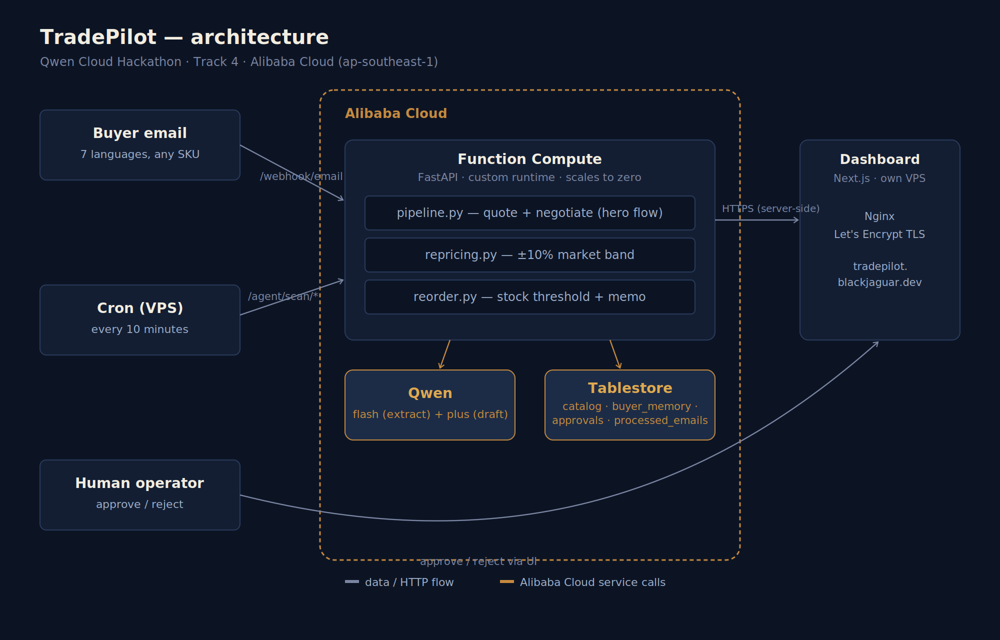

# TradePilot 🚀

**Cross-border operations copilot for sellers on the Alibaba/AliExpress ecosystem.**

Reads buyer emails in any language, builds quotes against the seller's real catalog,
negotiates using competitor pricing as a market signal, reprices the catalog, and flags
low inventory — asking for human approval **only when the risk warrants it**.

> Hackathon: **Global AI Hackathon Series with Qwen Cloud** · Track 4 — Autopilot Agent.
> Live demo: **https://tradepilot.blackjaguar.dev**

---

## Why Qwen (a genuine edge, not bolted on)

1. **Low cost-per-token** → high-volume decision-making is viable in real unit economics
   (`qwen-flash` for high-volume extraction, `qwen-plus` only for final drafting).
2. **Native integration with the Alibaba ecosystem** — Tablestore and Function Compute, not
   third-party services glued on with tape.
3. **Genuinely multilingual** — the agent reads and replies in the buyer's language (tested
   across 7 languages: en/es/zh/fr/de/pt/ar), even translating variant names against a
   controlled catalog vocabulary.

## The architecture decision we didn't compromise on

**The LLM never decides how much money gets approved.** `qwen-flash` extracts data,
`qwen-plus` drafts text — but the discount, the new price, and the production quantity all
come from 100% deterministic Python policy (`app/agent/policy.py`, `repricing.py`,
`reorder.py`). A language model can't hallucinate a discount it never computed.

## Architecture: one agent core, three triggers, one dashboard

```
                    ┌─────────────────────────────────────────┐
                    │      Alibaba Cloud (ap-southeast-1)      │
                    │                                           │
  Real email ──────▶│  Function Compute (FastAPI, custom rt.)  │
  /webhook/email     │    ├─ pipeline.py  (extract→resolve→     │
                     │    │   decide→draft, Qwen-flash+plus)    │
  Cron every 10min ─▶│    ├─ repricing.py (±10% band)            │
  /agent/scan/*       │    └─ reorder.py   (stock threshold)      │
                     │              │                            │
                     │       Tablestore (catalog, buyer_memory,  │
                     │       approvals, processed_emails)        │
                     └──────────────┬────────────────────────────┘
                                    │ HTTPS (server-side proxy,
                                    │ no CORS on the backend)
                    ┌───────────────▼────────────────┐
                    │   tradepilot.blackjaguar.dev     │
                    │   Next.js (Docker, own VPS)      │
                    │   Nginx + Let's Encrypt           │
                    └───────────────────────────────────┘
```



These aren't three separate systems — they're three triggers feeding the **same** Qwen
agent, the **same** catalog (Tablestore), the **same** memory, and the **same** human
checkpoint (a single approvals queue, distinguished by `kind`: `quote` | `reprice` |
`reorder`).

| Sub-flow | Trigger | What it does |
|---|---|---|
| 1 · Quote + negotiation (hero) | inbound email / webhook | parses, detects language/intent, disambiguates the product, quotes and negotiates using competitor data |
| 2 · Repricing | cron every 10 min | adjusts price within a ±10% band, escalates outside it |
| 3 · Reorder / production | cron every 10 min | compares stock vs. threshold, drafts a production memo |

**Escalation bands** (same criteria across all three sub-flows):

| Band | Discount / deviation | Action |
|---|---|---|
| Autopilot | ≤ 8% (quote) · ≤ 10% (reprice) | approved / applied automatically |
| Soft review | 8-15% (quote only) | answered automatically, flagged for audit |
| Held | > 15% (quote) · > 10% (reprice) · always (reorder) | blocked until you sign off |

## Anti-RAG catalog design (Phase 1)

80% of product lines repeat across all 3 catalogs (own seller + 2 competitors) with the
same name but different SKU/price. A plain text-similarity RAG would find 3 equally
"relevant" candidates — the agent resolves by **real context** (which seller the email
arrived at), not semantic similarity. Within the seller's own catalog, a product line has
up to 5 near-identical variant names (`iPhone 16` vs `iPhone 16 Pro`, `Galaxy S26` vs
`Galaxy S26+`) — matching prioritizes exact match over substring so one product never gets
confused for another.

## Stack

| Layer | Tool |
|---|---|
| LLM | Qwen (`qwen-flash` + `qwen-plus`, OpenAI-compatible API via Model Studio) |
| Backend | Python + FastAPI, custom runtime on Function Compute |
| Memory/DB | Alibaba Cloud Tablestore |
| Backend deploy | Alibaba Cloud Function Compute (serverless, scales to zero) |
| Frontend | Next.js 14 (App Router), Docker, own VPS |
| Proxy/TLS | Nginx + Let's Encrypt (VPS) |

## Repo structure

```
tradepilot/
├── app/
│   ├── main.py              # FastAPI: ingestion, scans, read endpoints for the dashboard
│   ├── config.py             # typed config from environment
│   ├── agent/
│   │   ├── pipeline.py       # hero-flow orchestrator (sub-flow 1)
│   │   ├── repricing.py      # sub-flow 2
│   │   ├── reorder.py        # sub-flow 3
│   │   ├── policy.py         # discount policy — deterministic
│   │   ├── catalog.py        # anti-RAG matching + market benchmark
│   │   ├── store.py          # approvals, buyer memory, idempotency
│   │   └── schemas.py        # Pydantic contracts between stages
│   └── clients/
│       ├── qwen.py           # Qwen client (fast + smart)
│       └── tablestore.py     # Tablestore client (OTS)
├── scripts/
│   ├── verify_setup.py       # Phase 0 checkpoint
│   ├── generate_fixtures.py  # generates catalogs + 18 test emails
│   ├── seed_tablestore.py    # seeds Tablestore
│   ├── run_demo.py           # runs all 18 emails in one go
│   ├── run_scan_demo.py      # runs repricing + reorder in one go
│   └── reset_runtime_data.py # clears operational state (approvals/memory/cache)
├── data/                     # generated catalogs and emails (Phase 1)
├── web/                      # Next.js dashboard (Phase 4) — see web/README.md
├── s.template.yaml           # deploy template (Serverless Devs, no secrets)
├── bootstrap                 # Function Compute custom runtime entrypoint
└── requirements.txt
```

## Local setup

```bash
python -m venv .venv && source .venv/bin/activate
pip install -r requirements.txt
cp .env.example .env      # fill in with your real credentials
python -m scripts.verify_setup     # checkpoint: Qwen + Tablestore + env
python -m scripts.generate_fixtures
python -m scripts.seed_tablestore
python -m scripts.run_demo         # smoke test: 18 emails, covers all 3 bands
python -m scripts.run_scan_demo    # smoke test: repricing + reorder
uvicorn app.main:app --reload
```

## Deploy to Function Compute

The real `s.yaml` is generated from `s.template.yaml` with `envsubst` — it's never
committed with secrets injected.

```bash
npm install -g @serverless-devs/s
s config add                                  # your AccessKey (RAM user, not root account)

export $(grep -v '^#' .env | xargs)
envsubst < s.template.yaml > s.yaml
s build --use-docker                          # installs requirements.txt into ./python
s deploy
s info                                         # public URL of the HTTP trigger
```

Repricing/reorder automation — external cron on your own server (not FC's native timer
trigger, simpler and more reliable):

```bash
*/10 * * * * /path/to/scan_cron.sh >> /var/log/tradepilot-cron.log 2>&1
```

## Dashboard (Phase 4)

See [`web/README.md`](./web/README.md) for the full dashboard deploy on your own VPS via
Docker + Nginx + Let's Encrypt.

## Known limitations (honesty, not filler)

- The scan endpoint (`/agent/scan/*`) is public with no authentication — acceptable for
  hackathon scope, not for real production without adding auth.
- "Reject" in the approvals queue only changes the status — it doesn't automatically send
  a rejection email to the buyer.
- *Product line* matching (not variant matching) is still literal token comparison — it
  fails safe (asks for clarification) when the name doesn't match in another language, but
  doesn't translate the way variant matching does.

## License

MIT — see [LICENSE](./LICENSE).
